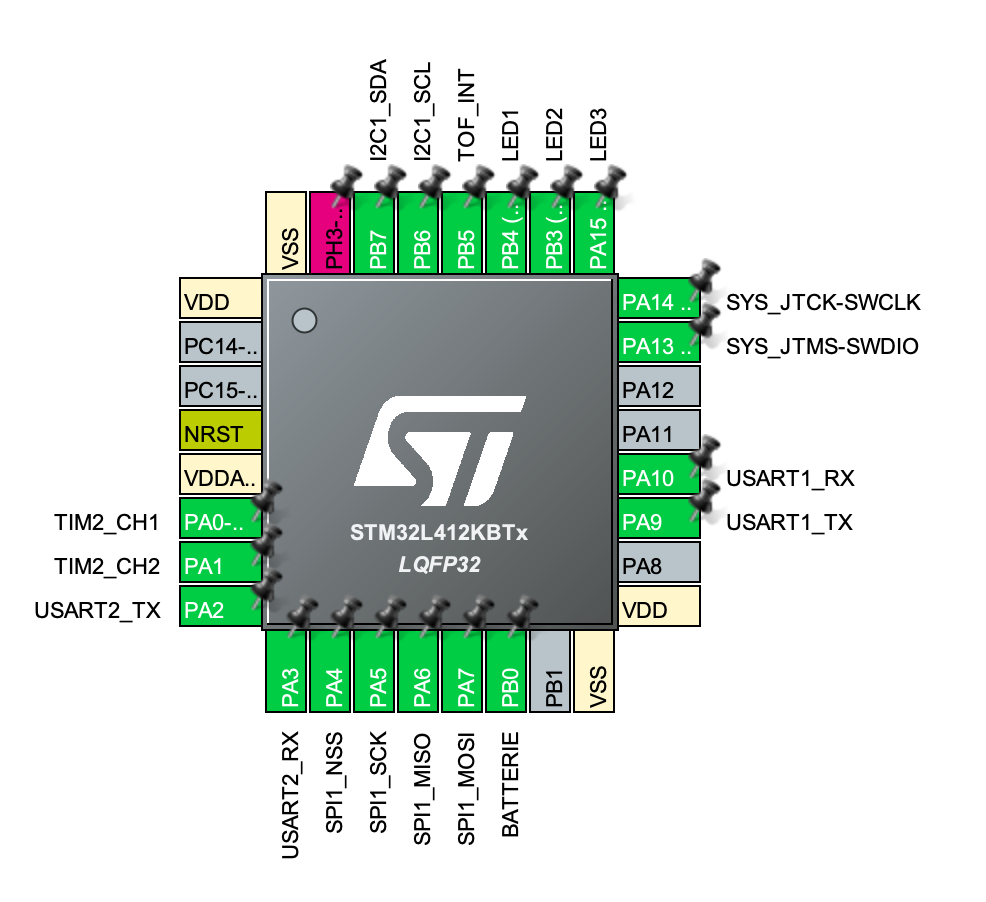

# Utilisation Notice

## General 

The goal of the drone is to take off, reach a predefined altitude, capture a photo, and then descend.

Altitude commands are sent from the PC to the Raspberry Pi Zero via Wi-Fi using Python scripts. A custom graphical interface has been developed on the PC to control this process. The Raspberry Pi then communicates with the microcontroller on the PCB through a UART (USART) serial connection, using both Python and C code. It is also responsible for capturing images through a CSI camera interface.

The microcontroller, embedded on the custom PCB, manages the drone's motors using PWM signals (written in C), and receives altitude data from a Time-of-Flight (TOF) sensor over an I2C bus, also handled via C code.

## Architecture 


## Structure of Mini-Ingenuity (Hardware files)

### 3D structural parts 
 
files concerned: `Hardware/3D files/files.stl`:
``````
3D files
│   │   ├── 3D_boulons_structure_drone.stl
│   │   ├── 3D_tube_structure_drone.stl
│   │   └── 3D_vises_structure_drone.stl
``````
The screws, bolts, and tubes allow you to assemble the wooden parts together and build the structure of the drone.

Machine used: a 3D printer


### Wood structure 

files concerned: `Hardware/Wood structure/Bois.stl`

Our wood sheets are 5 mm thick. 

Machine used: a laser cutter 

### Picture of the Structure 


## PCB (Hardware files)

files concerned: `Hardware/KiCAD/...`

### BOM

First, you will need all the required components. You can find all the necessary information — references, quantities, etc. — in the Bill of Materials (BOM).

[BOM](Hardware/KiCAD/BOMv3.csv)

### KiCad

Software used: KiCad
All the KiCad files required to build the PCB are available in this repository.

Picture of the PCB: [PCB Picture](Assets/IMG_6468.png)

## Code (Software)

### Python code 

files concerned: `Software/Python`
requiered functions: `Software/Python/requirements.txt`
Notice : `Software/Python/Notice.md`

#### Initialization

Start by importing all the libraries listed in the `requirements` file. Follow the steps indicated in `Software/Python/Notice.md`.

#### Graphic User Interface

There are a total of five different buttons:  
- First, you must click on the gear icon in the top left corner. This allows you to enter your system's "coordinates": **IP** and **port**.  

- Then, press the button with the Wi-Fi logo on the right to connect to the RPi0 (Note that the script `Software/Python/server.py` must have been executed on the Raspberry Pi beforehand).  

- Now, let's go over the three remaining buttons:  
    - The button on the far left (***Command***) allows you to control the drone's altitude using your keyboard. Here are the available commands:  
        - Alt + UP_Arrow → +1   //   Alt + DOWN_Arrow → -1  
        - UP_Arrow → +5   //   DOWN_Arrow → -5  
        - Ctrl + UP_Arrow → +10   //   Ctrl + DOWN_Arrow → -10  
    - The center button (***Photo***) allows you to take a photo (how to retrieve it is explained in `Notice.md`).  
    - The button on the right (***Auto***) allows you to enter a specific height (in mm) for the drone to reach.

#### Emergency stop

If you want to do an Emergency stop, you just have to tap the ***esc*** touch on your keyboard, this will disconnect the computer to the RPi0 and the speed of the motor will decrease to zero. 

#### Get the photo

To get the photo, everything is explained in the `Software/Python/Notice.md` file. 

### Code for the microcontroller (STM32CubeIDE)

First, if you don't already have it, download the software STM32CubeIDE. 

Use the official ST website: https://www.st.com/en/development-tools/stm32cubeide.html


Then also download our STM32 project from this github repository.

You can dowload the repository as shown in the following capture:


Now, you're ready to open the code with STM32CubeIDE. You can click "Open Project from File System..." and select the one you just downloaded.


After that, use the "Project Explorer" view to navigate to the "main.c" file as shown here:


files concerned: `Software/C`

#### PINs




### TOF 

Start by copying the ```VL53L1X_ULD_API``` in your project. You want to configure the paths in your IDE (eg. in STM32CubeIDE : ```Project > Properties``` then ```C/C++ General > Paths and Symbols```).

detailed explanations: https://github.com/lfiack/tof_VL53L1X-SATEL/blob/main/README.md

You can refer to the datasheet for information on how to connect to the PCB: 

[TOF Datasheet](Datasheets/TOF.pdf)


