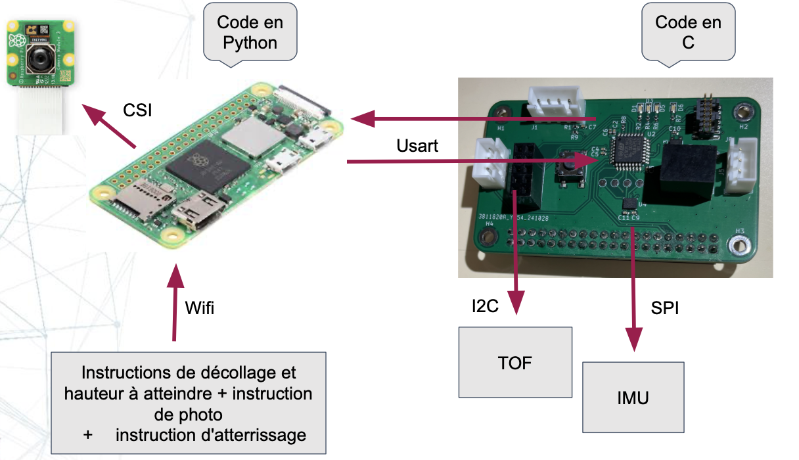

# 2425_Projet2A_Ingenuity

**Students :**

- Pénélope HENNER - penelope.henner@ensea.fr
- Kavin DUGARD - kevin.dugard@ensea.fr 
- Elio FLANDIN - elio.flandin@ensea.fr
- Joel COLASO - joel.colaso@ensea.fr


## Project background:

Mars 2020 is a space mission to deploy the Perseverance rover on the Martian surface to study its surface and collect soil samples. It is the first of a series of three missions whose ultimate aim is to return these samples to Earth for analysis.

Ingenuity is a small helicopter developed by NASA, the US space agency. It is being used experimentally on the surface of Mars during the Mars 2020 mission. The helicopter is on board the Perseverance rover.

On April 19, 2021, for the first time in the history of the space age, a spacecraft makes a powered flight through the tenuous atmosphere of another planet. Ingenuity's objective is optical reconnaissance of the terrain, with the helicopter taking numerous aerial photos used by the pilots of the Perseverance astromobile to identify obstacles and promising sites (taking rock samples from the Martian soil).

Ingenuity is a 1.8 kg helicopter with 2 coaxial counter-rotating rotors. It draws its energy from 6 lithium-ion batteries recharged by solar cells. Its navigation system enables it to follow a pre-programmed route without human intervention. Its only payload is a camera.

The mission recently came to an end (January 18, 2024) when a blade broke during the 72nd flight.

Ingenuity has opened up new prospects for Mars exploration. NASA and ESA, as part of their Mars sample return mission, are now including 2 similar helicopters to collect the tubes containing the Martian samples deposited by the Perseverance astromobile in the event of its failure.

 Our project is therefore to try to build the Ingenuity module in miniature. In other words, we want to create a vehicle that can move through the air and take a photo of what's going on below.

 [Learn more about the Mars 2020 mission](Ingenuity%20March%202020.md)


## Our project

Our project is to try and make this helicopter in miniature mode. In other words, we want to create a vehicle that can move through the air and take a photo of what's happening below. To do this, we'll have a total of 10 sessions in which we'll have to mix PCBs, coding, soldering and so on.

## Project architecture




## Description of repo structure:

``````
.
├── Assets/            # Project images (drone, PCB)
├── Datasheets/        # Component datasheets
├── Hardware/          # Architecture diagrams, KiCad (PCB) files and 3D files
├── Software/          # Embedded code (STM32) + Python code + TOF module
├── README.md          # Main project documentation
├── Ingenuity March 2020.md  # Background on the Mars 2020 mission


``````

In the **Assets** folder, you will find pictures of the drone and the assembled PCB.

The **Datasheets** folder contains documentation for all the components we used throughout the project.

The **Hardware** folder includes all the KiCad files needed to reproduce our custom PCB, along with the Bill of Materials (BOM) listing all components, their references, and specifications. You will also find files for 3D printing and laser cutting the various structural parts of the drone.

The **Software** folder contains:
- The **Python code** used to build the graphical user interface (GUI) on the PC to communicate with the Raspberry Pi (`Client_GUI.py`).
- The **Python code** running on the Raspberry Pi, which handles communication with the microcontroller and takes pictures (`server.py`).
- The **TOF code** (developed with STM32CubeIDE), which is responsible for sending the drone’s altitude using a Time-of-Flight sensor.
- The **C code** (also under STM32CubeIDE) in `Ingenuity_2A`, running on the STM32 microcontroller, which receives commands from the Raspberry Pi and manages the components such as motors, TOF sensor, etc.

## Environments used: 

### Machines Used
- **PC (Windows/macOS/Linux)**: Used for development (STM32CubeIDE, Python, OnShape, etc.).
- **Function Generator (GBF)**: Used to simulate control signals during motor testing.
- **Laser Cutter (FabLab)**: Used to cut the wooden drone structure.

### Hardware
- **Raspberry Pi Zero**: A single-board computer used for image capture, PCB interfacing, and running Python scripts.
- **STM32L412KBT6**: Main microcontroller used on the custom PCB.
- **VL53L1X**: Time-of-Flight (ToF) distance sensor.
- **ESC (Electronic Speed Controllers)**: To control brushless motors.
- **Brushless Motors**: Used to generate drone thrust.
- **LDO BU33TD3WG**: Low-dropout voltage regulator.
- **Buck Converter 17395xx36**: DC-DC converter used to step down voltage.
- **MOSFETs**: Used for power switching and motor control.
- **Camera (connected to Raspberry Pi)**: Captures aerial images.

### Software
#### Embedded Development
- **STM32CubeIDE**: Used to write, compile, and flash firmware to the microcontroller.
- **STM32 HAL Drivers**: Low-level drivers for managing STM32 peripherals.

#### Electronic Design
- **KiCad**: Used for circuit schematic design, PCB layout, and Gerber/BOM export.
- **OnShape**: Used for 3D modeling of the drone structure.

#### Python Development
- **Python 3**: Used for drone communication scripts and the graphical user interface (GUI).
- **Tkinter / PyQt**: Used to build the GUI interface.
- **Pygame / Other sound libraries**: For playing feedback sounds (from the `sounds/` folder).
- **Flask / TCP Sockets**: For communication between the GUI and the drone.

## Precision on the TOF VL53L1X

Start by copying the ```VL53L1X_ULD_API``` in your project. You want to configure the paths in your IDE (eg. in STM32CubeIDE : ```Project > Properties``` then ```C/C++ General > Paths and Symbols```).

Source (code and explanations): https://github.com/lfiack/tof_VL53L1X-SATEL/blob/main/README.md

## Precise notice of our project 

[Mini-Ingenuity notice](Mini-Ingenuity_notice.md)

## Logbook

[Logbook](LogBook.md)

## Picture of Mini-Ingenuity 


